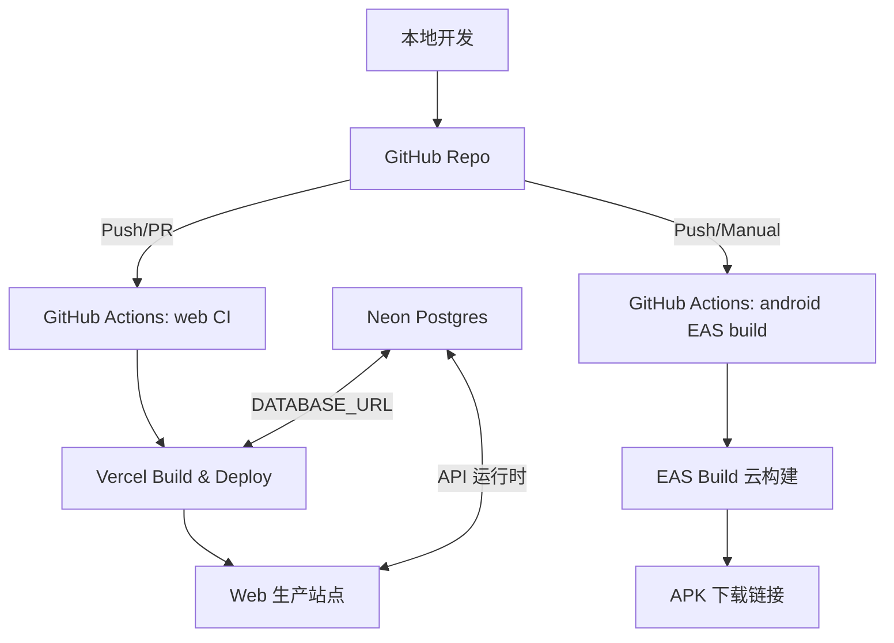

# CI/CD 教程（本项目：Web + Android）

## 一张图看懂整体流程

---

## 为什么需要这样的工作流

1. **减少人为失误**：每次提交自动跑构建/检查，避免“本地能跑、线上失败”。
2. **保证交付一致**：Web 与 Android 打包由统一流程产出，结果可复现。
3. **提高迭代速度**：推送后自动部署/打包，减少手动操作。
4. **质量可追溯**：每次构建都有日志和版本记录，方便回滚与排障。

---

## 它的作用是什么（直观理解）

- **GitHub Actions = 自动化工人**
  负责执行一系列重复但关键的任务。
- **Web CI = 质量门禁**
  构建/检查不过就阻止上线，保证线上稳定。
- **Vercel 部署 = 自动上架**
  Web 端代码一更新，就会自动发布到线上。
- **EAS Build = 自动打包 APK**
  不需要本地 Android SDK，也能稳定产出 APK。

---

## 组件背景（为什么选择它们）

- **GitHub**：代码版本管理与协作中心。
- **GitHub Actions**：官方自动化流水线工具。
- **Vercel**：针对 Next.js 最佳的自动部署平台。
- **Neon**：托管 Postgres，适合云端/Serverless。
- **EAS Build**：Expo 官方的云构建系统，产出 APK。

---

## 当前工作流设置（大致结构）

### 1) Web CI（`.github/workflows/ci.yml`）
- **触发**：Push/PR 到 `master`
- **环境**：Ubuntu + Node 20
- **服务**：Postgres（CI 中启动容器）
- **步骤**：
  1. `npm ci`
  2. `npm run lint`
  3. `npm run build`

### 2) Android EAS Build（`.github/workflows/eas-build.yml`）
- **触发**：Push（`mobile/**`）或手动触发
- **环境**：Ubuntu + Node 20
- **依赖**：`EXPO_TOKEN`（GitHub Secrets）
- **步骤**：
  1. `npm ci`
  2. `npx eas-cli build --platform android --profile preview --non-interactive`

---

## 运行结果

- **Web 端**：部署到 Vercel，访问线上域名
- **Android**：产出 APK 下载链接

---

## 常见问题

### 1) 为什么需要 EXPO_TOKEN？
EAS Build 需要访问 Expo 的云端构建服务，Token 用来完成鉴权。

### 2) 为什么 CI 要启 Postgres？
因为生产数据库是 Postgres（Neon），CI 必须模拟相同环境，避免上线踩坑。

### 3) 为什么 Vercel + Neon？
- Vercel 负责 Web 部署
- Neon 负责数据库
两者结合是现代 Serverless 的常见组合。

